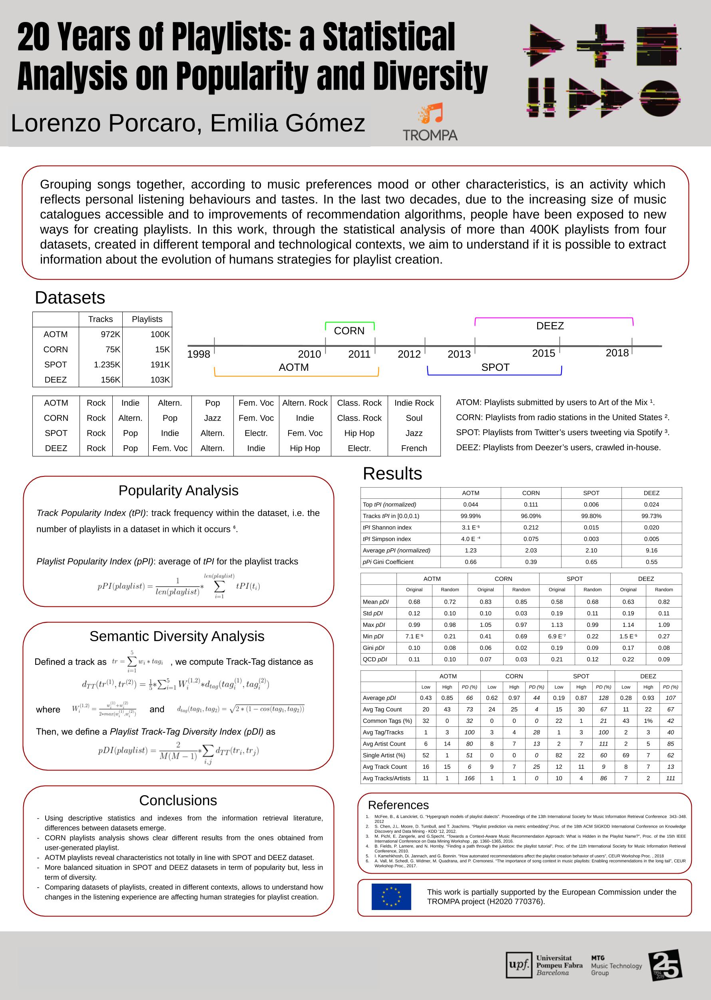
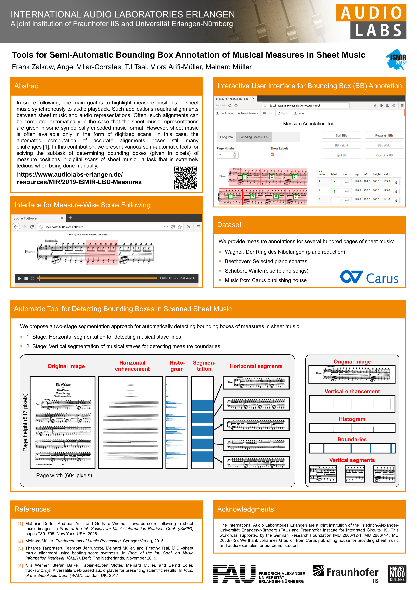

# ismir-2019-posters

## How to add your poster
Add it by making a pull request!

- fork this repo and clone it to your local computer
- update the repo with your poster and its description
  - git add your poster image to `posters/` folder
    - or just directly upload to the folder on your webbrowser
  - update your repo's `readme.md` with the right format (you can also directly edit it on webbrowser)
    ```
    ### [poster session code] TITLE | LINK_TO_PAPER | LINK_TO_CODE | LINK_TO_WHATEVER

    AUTHOR NAMES

    > "SHORT DESCRIPTION THAT YOU USED IN THE CONFERENCE WEBSITE"

    POSTER IMAGE HERE WITH A RELATIVE LINK, i.e.,
    
    ```
- commit, push
- make sure it looks good on `readme.md` of your forked repo
- make a pull request
- DO NOT CHANGE OTHERS' POSTERS - WE DON'T NEED A MERGE CONFLICT HERE!

## Sessions
[Session A](https://github.com/keunwoochoi/ismir-2019-posters#session-a),
[Session B](https://github.com/keunwoochoi/ismir-2019-posters#session-b),
[Session C](https://github.com/keunwoochoi/ismir-2019-posters#session-c),
[Session D](https://github.com/keunwoochoi/ismir-2019-posters#session-d),
[Session E](https://github.com/keunwoochoi/ismir-2019-posters#session-e),
[Session F](https://github.com/keunwoochoi/ismir-2019-posters#session-f),
[Session G](https://github.com/keunwoochoi/ismir-2019-posters#session-g),
[Late-Breaking/Demo](https://github.com/keunwoochoi/ismir-2019-posters#late-breakingdemo)
[MIREX](https://github.com/keunwoochoi/ismir-2019-posters#mirex)

## Session A

### [A-01] Zero-shot Learning for Audio-based Music Classification and Tagging | [paper](http://archives.ismir.net/ismir2019/paper/000005.pdf) | [code](https://github.com/kunimi00/ZSL_music_tagging)
[Jeong Choi](https://jeongchoi.home.blog/); [Jongpil Lee](https://jongpillee.github.io/); Jiyoung Park; [Juhan Nam](http://mac.kaist.ac.kr/~juhan/)
> "Investigated the paradigm of zero-shot learning applied to music domain. Organized 2 side information setups for music calssification task. Proposed a data split scheme and associated evaluation settings for the multi-label zero-shot learning."


### [A-09] 20 Years of Playlists: A Statistical Analysis on Popularity and Diversity | [paper](http://archives.ismir.net/ismir2019/paper/000013.pdf) | [code](https://github.com/MTG/playlists-stat-analysis)

[Lorenzo Porcaro](https://lorenzoporcaro.wordpress.com/); [Emilia Gómez](https://emiliagomez.com/)
> "We find extremely valuable to compare playlist datasets generated in different contexts, as it allows to understand how changes in the listening experience are affecting playlist creation strategies."




### [A-13] Conditioned-U-Net: Introducing a Control Mechanism in the U-Net for Multiple Source Separations | [paper](http://archives.ismir.net/ismir2019/paper/000017.pdf) | [code](https://github.com/gabolsgabs/cunet)

[Gabriel Meseguer-Brocal](https://github.com/gabolsgabs/); [Geoffroy Peeters](https://perso.telecom-paristech.fr/gpeeters/)
> "In this paper, we apply conditioning learning to source separation and introduce a control mechanism to the standard U-Net architecture. The control mechanism allows multiple instrument separations with just one model without losing performance."


## Session B

### [B-02] Deep Unsupervised Drum Transcription | [paper](http://archives.ismir.net/ismir2019/paper/000020.pdf) | [code](https://github.com/keunwoochoi/DrummerNet)

[Keunwoo Choi](https://keunwoochoi.wordpress.com); [Kyunghyun Cho](http://www.kyunghyuncho.me)
> "DrummerNet is a drum transcriber trained in an unsupervised fashion. DrummerNet learns to transcribe by learning to reconstruct the audio with the transcription estimate. Unsupervised learning + a large dataset allow DrummerNet to be less-biased."


### [B-09] Towards Explainable Emotion Recognition in Music: The Route via Mid-level Features | [paper](http://archives.ismir.net/ismir2019/paper/000027.pdf) |  [demo](https://shreyanc.github.io/ismir_example.html)

[Shreyan Chowdhury](https://shreyanc.github.io), Andreu Vall Portabella, Verena Haunschmid, Gerhard Widmer

> "Explainable predictions of emotion from music can be obtained by introducing an intermediate representation of mid-level perceptual features in the predictor deep neural network."


## Session C


## Session D

### [D-04] A Dataset of Rhytmic Pattern Reproductions and Baseline Automatic Assessment System | [paper](http://archives.ismir.net/ismir2019/paper/000052.pdf) | [code](https://github.com/MTG/mast-rhythm-analysis) | [MAST rhythm dataset](https://zenodo.org/record/2620357) | [re-annotated dataset](https://zenodo.org/record/2619499)

[Felipe Falcão](https://www.linkedin.com/in/felipe29vieira), Baris Bozkurt, Xavier Serra, Nazareno Andrade, Ozan Baysal
> "This present work is an effort to address the shortage of music datasets designed for rhythmic assessment. A new dataset and baseline rhythmic assessment system are provided in order to support comparative studies about rhythmic assessment."


## Session E

### [E-06] FMP Notebooks: Educational Material for Teaching and Learning Fundamentals of Music Processing | [paper](http://archives.ismir.net/ismir2019/paper/000069.pdf) | [web](https://www.audiolabs-erlangen.de/FMP)

[Meinard Müller](https://www.audiolabs-erlangen.de/fau/professor/mueller); [Frank Zalkow](https://www.audiolabs-erlangen.de/fau/assistant/zalkow)
> "The FMP notebooks include open-source Python code, Jupyter notebooks, detailed explanations, as well as numerous audio and music examples for teaching and learning MIR and audio signal processing."


## Session F

## Session G

### [G-03] Adaptive Time–Frequency Scattering for Periodic Modulation Recognition in Music Signals | [paper](http://archives.ismir.net/ismir2019/paper/000099.pdf) | [dataset](https://zenodo.org/record/3250223)

[Changhong Wang](https://changhongw.github.io/); Emmanouil Benetos; Vincent Lostanlen; Elaine Chew
> "Scattering transform provides a versatile and compact representation for analysing playing techniques."


### [G-16] VirtuosoNet: A Hierarchical RNN-based System for Modeling Expressive Piano Performance  | [paper] (http://archives.ismir.net/ismir2019/paper/000112.pdf) | [code](https://github.com/jdasam/virtuosoNet)
Dasaem Jeong; Taegyun Kwon; Yoojin Kim; Kyogu Lee; Juhan Nam

> "We present an RNN-based model that reads MusicXML and generates human-like performance MIDI. The model employs a hierarchical approach by using attention network and an independent measure-level estimation module. We share our code and dataset."


## Late-Breaking/Demo

### [L-06] Tools for Semi-Automatic Bounding Box Annotation of Musical Measures in Sheet Music | [paper](http://archives.ismir.net/ismir2019/latebreaking/000006.pdf) | [web](https://www.audiolabs-erlangen.de/resources/MIR/2019-ISMIR-LBD-Measures)

[Frank Zalkow](https://www.audiolabs-erlangen.de/fau/assistant/zalkow); [Angel Villar Corrales](); [TJ Tsai](http://pages.hmc.edu/ttsai/); [Vlora Arifi-Müller](https://www.audiolabs-erlangen.de/fau/assistant/arifi-mueller); [Meinard Müller](https://www.audiolabs-erlangen.de/fau/professor/mueller);
> "In score following, one main goal is to highlight measure positions in sheet music synchronously to audio playback. Such applications require alignments between sheet music and audio representations. Often, such alignments can be computed automatically in the case that the sheet music representations are given in some symbolically encoded music format. However, sheet music is often available only in the form of digitized scans. In this case, the automated computation of accurate alignments poses still many challenges [1]. In this contribution, we present various semi-automatic tools for solving the subtask of determining bounding boxes (given in pixels) of measure positions in digital scans of sheet music—a task that is extremely tedious when being done manually."



### [L-07] Improving Music Tagging from Audio with User-Track Interactions | [paper](http://archives.ismir.net/ismir2019/latebreaking/000007.pdf)

[Andres Ferraro](https://github.com/andrebola); [Jae Ho Jeon](https://www.linkedin.com/in/jae-ho-jeon-036927126); [Jisang Yoon](https://github.com/js1010); [Xavier Serra](https://www.upf.edu/web/xavier-serra); [Dmitry Bogdanov](https://dbogdanov.github.io/about/)
> "We propose to improve the tagging of music by using audio and collaborative filtering information (user-track interactions). We use Matrix Factorization (MF) to obtain a representation of the tracks from the user-track interactions and map those representations to the tags predicted from audio. The preliminary results show that following this approach we can increase the tagging performance."


### [L-10] Creating a Tool for Faciltiating and Researching Human Annotation of Musical Patterns | [paper](http://archives.ismir.net/ismir2019/latebreaking/000010.pdf) | [code](https://github.com/StephanWells/ANOMIC)

[Stephan Wells](); [Iris Yuping Ren](http://irisryp.me/); [Anja Volk](http://www.staff.science.uu.nl/~fleis102/)
> "Musical patterns (repeated segments of music) are highly widespread in all varieties of music, and annotations of such patterns are valuable in many areas of music information retrieval. Unfortunately, there is a lack of expert annotations of musical patterns, and most annotation is done by hand. In this project, we introduce a novel software, ANOMIC, designed for users to intuitively annotate repeated musical segments, and we perform a user study which yields a large database of annotations done using the tool. We find that the tool’s reception was strongly positive and show that the annotations done with it reach high levels of inter-annotator agreement compared to traditional approaches."


### [L-45] An Opensource Web-based Pattern Annotation Framework - PAF | [paper](http://archives.ismir.net/ismir2019/latebreaking/000045.pdf) | [code](https://bitbucket.org/ul-fri-lgm/patternannotationframework/src)

[Matevž Pesek](); [Darian Tomašević](); [Iris Yuping Ren](http://irisryp.me/); [Matija Marolt]()
> "The Pattern Annotation Framework (PAF) tool collects the data about the annotator and the annotation process, to enable an analysis of relations between the user's experience/background and the annotations. The tool tracks the user's actions, such as the start and end time of an individual annotation and its changes, midi player actions and other. By open-sourcing the tool, we hope to aid other researchers in the MIR field dealing with pattern-related data gathering."


### [L-49] Linking and Visualising Performance Data and Semantic Music Encodings in Real-Time | [paper](http://archives.ismir.net/ismir2019/latebreaking/000049.pdf) | [code](https://github.com/trompamusic/clara) | [web](https://trompa.mdw.ac.at)

[David M. Weigl](https://iwk.mdw.ac.at/david-weigl); [Carlos Cancino-Chacón](http://carloscancinochacon.com/); [Martin Bonev](); [Werner Goebl](https://www.mdw.ac.at/iwk/werner-goebl/)
> "We present CLARA (Companion for Long-term Analyses of Rehearsal Attempts), a visualisation interface for real-time performance-to-score alignment based on the MELD (Music Encoding and Linked Data) framework for semantic digital notation, employing MAPS (Matcher for Alignment of Performance and Score), an HMM-based polyphonic score-following system for symbolic (MIDI) piano performances."


## MIREX
