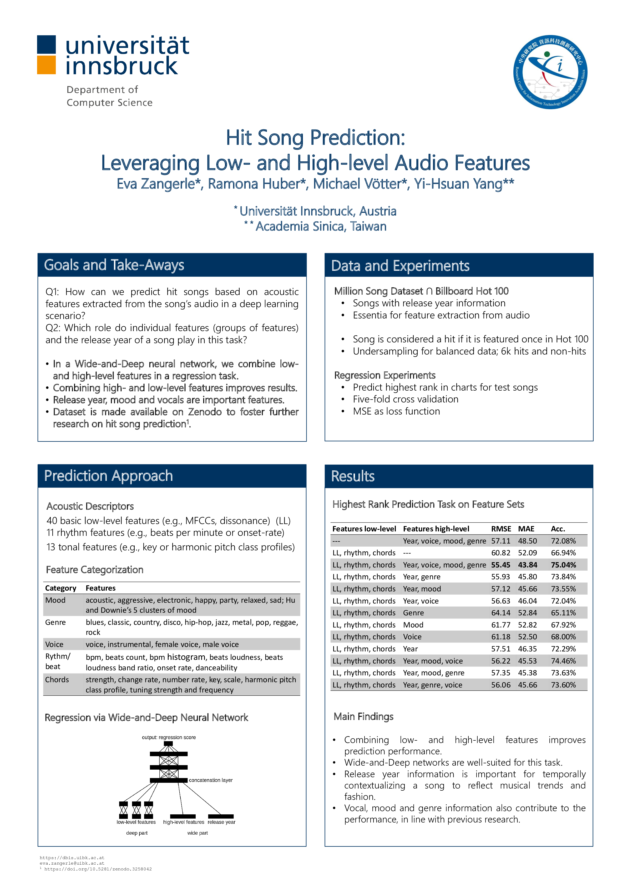
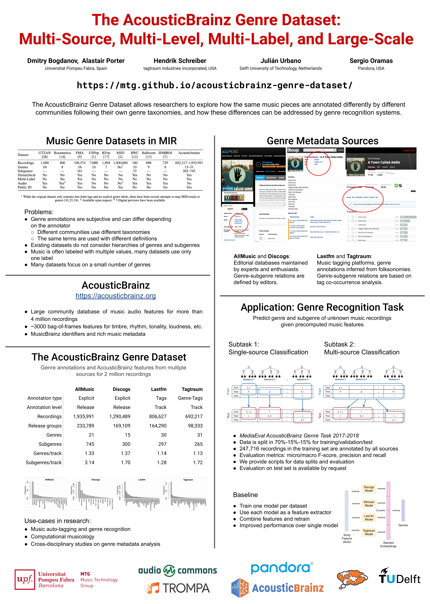

# Online session 1/2 (Sessions A, B, C, D)

## Sessions
[Session A](#session-a),
[Session B](#session-b),
[Session C](#session-c),
[Session D](#session-d),

## Session A

### [A-01] Zero-shot Learning for Audio-based Music Classification and Tagging | [paper](http://archives.ismir.net/ismir2019/paper/000005.pdf) | [code](https://github.com/kunimi00/ZSL_music_tagging)
[Jeong Choi](https://jeongchoi.home.blog/); [Jongpil Lee](https://jongpillee.github.io/); Jiyoung Park; [Juhan Nam](http://mac.kaist.ac.kr/~juhan/)
> "Investigated the paradigm of zero-shot learning applied to music domain. Organized 2 side information setups for music calssification task. Proposed a data split scheme and associated evaluation settings for the multi-label zero-shot learning."

### [A-09] 20 Years of Playlists: A Statistical Analysis on Popularity and Diversity | [paper](http://archives.ismir.net/ismir2019/paper/000013.pdf) | [code](https://github.com/MTG/playlists-stat-analysis)

[Lorenzo Porcaro](https://lorenzoporcaro.wordpress.com/); [Emilia Gómez](https://emiliagomez.com/)
> "We find extremely valuable to compare playlist datasets generated in different contexts, as it allows to understand how changes in the listening experience are affecting playlist creation strategies."

### [A-13] Conditioned-U-Net: Introducing a Control Mechanism in the U-Net for Multiple Source Separations | [paper](http://archives.ismir.net/ismir2019/paper/000017.pdf) | [code](https://github.com/gabolsgabs/cunet)

[Gabriel Meseguer-Brocal](https://github.com/gabolsgabs/); [Geoffroy Peeters](https://perso.telecom-paristech.fr/gpeeters/)
> "In this paper, we apply conditioning learning to source separation and introduce a control mechanism to the standard U-Net architecture. The control mechanism allows multiple instrument separations with just one model without losing performance."

## Session B

### [B-02] Deep Unsupervised Drum Transcription | [paper](http://archives.ismir.net/ismir2019/paper/000020.pdf) | [code](https://github.com/keunwoochoi/DrummerNet)

[Keunwoo Choi](https://keunwoochoi.wordpress.com); [Kyunghyun Cho](http://www.kyunghyuncho.me)
> "DrummerNet is a drum transcriber trained in an unsupervised fashion. DrummerNet learns to transcribe by learning to reconstruct the audio with the transcription estimate. Unsupervised learning + a large dataset allow DrummerNet to be less-biased."

### [B-09] Towards Explainable Emotion Recognition in Music: The Route via Mid-level Features | [paper](http://archives.ismir.net/ismir2019/paper/000027.pdf) |  [demo](https://shreyanc.github.io/ismir_example.html)

[Shreyan Chowdhury](https://shreyanc.github.io), Andreu Vall Portabella, [Verena Haunschmid](https://twitter.com/ExpectAPatronum), Gerhard Widmer

> "Explainable predictions of emotion from music can be obtained by introducing an intermediate representation of mid-level perceptual features in the predictor deep neural network."

## Session C

### [C-01] Learning a Joint Embedding Space of Monophonic and Mixed Music Signals for Singing Voice | [paper](http://archives.ismir.net/ismir2019/paper/000034.pdf) | [code](http://github.com/kyungyunlee/mono2mixed-singer) | [mashup example](http://kyungyunlee.github.io/archives/ISMIR2019-Mono2Mixed) 
    
[Kyungyun Lee](http://kyungyunlee.github.io); [Juhan Nam](http://mac.kaist.ac.kr/~juhan/)   

> "The paper introduces a new method of obtaining a consistent singing voice representation from both monophonic and mixed music signals. Also, it presents a simple music mashup pipeline to create a large synthetic singer dataset"
    

### [C-04] Hit Song Prediction: Leveraging Low- and High-Level Audio Features | [paper](https://doi.org/10.5281/zenodo.3258042) | [code](https://github.com/dbis-uibk/hit-prediction-code/) | [dataset](https://zenodo.org/record/3258042#.Xe5RI3VKhhE)

[Eva Zangerle](https://evazangerle.at); Michael Vötter; Ramona Huber; [Yi-Hsuan Yang](http://mac.citi.sinica.edu.tw/~yang/)

> "We show that for predicting the potential success of a song, both low- and high-level audio features are important. We use a deep and wide neural network to model these features and perform a regression task on the track’s rank in the charts."

### [C-07] Learning to Traverse Latent Spaces for Musical Score Inpainting | [paper](http://archives.ismir.net/ismir2019/paper/000040.pdf) | [code](https://github.com/ashispati/InpaintNet)  | [audio-examples](https://ashispati.github.io/inpaintnet/)

[Ashis Pati](https://ashispati.github.io), [Alexander Lerch](http://www.alexanderlerch.com), [Gaëtan Hadjeres](https://csl.sony.fr/team/gaetan-hadjeres/)

> "Recurrent Neural Networks can be trained using latent embeddings of a Variational Auto-Encoder-based model to to perform interactive music generation tasks such as inpainting."

### [C-09] The AcousticBrainz Genre Dataset: Multi-Source, Multi-Level, Multi-Label, and Large-Scale | [paper](http://archives.ismir.net/ismir2019/paper/000042.pdf) | [dataset](https://mtg.github.io/acousticbrainz-genre-dataset/)

[Dmitry Bogdanov](https://dbogdanov.github.io/), [Alastair Porter](https://www.upf.edu/web/alastair-porter), [Hendrik Schreiber](http://www.tagtraum.com/), [Julián Urbano](https://julian-urbano.info/), [Sergio Oramas](http://sergiooramas.com/)

> "The AcousticBrainz Genre Dataset allows researchers to explore how the same music pieces are annotated differently by different communities following their own genre taxonomies, and how these differences can be addressed by genre recognition systems."

## Session D

### [D-02] A Cross-Scape Plot Representation for Visualizing Symbolic Melodic Similarity | [paper](http://archives.ismir.net/ismir2019/paper/000050.pdf) | [code](https://github.com/saebyulpark/cross_scapeplot_visualization)
Saebyul Park; Taegyun Kwon; Jongpil Lee; Jeounghoon Kim; Juhan Nam
> "We propose a cross-scape plot representation to visualize multi-scaled melody similarity between two symbolic music. We evaluate its effectiveness on examples from folk music collections with similarity-based categories and plagiarism cases."

### [D-04] A Dataset of Rhytmic Pattern Reproductions and Baseline Automatic Assessment System | [paper](http://archives.ismir.net/ismir2019/paper/000052.pdf) | [code](https://github.com/MTG/mast-rhythm-analysis) | [MAST rhythm dataset](https://zenodo.org/record/2620357) | [re-annotated dataset](https://zenodo.org/record/2619499)

[Felipe Falcão](https://www.linkedin.com/in/felipe29vieira), Baris Bozkurt, Xavier Serra, Nazareno Andrade, Ozan Baysal
> "This present work is an effort to address the shortage of music datasets designed for rhythmic assessment. A new dataset and baseline rhythmic assessment system are provided in order to support comparative studies about rhythmic assessment."

### [D-06] Blending Acoustic and Language Model Predictions for Automatic Music Transcription | [paper](http://archives.ismir.net/ismir2019/paper/000054.pdf) | [code](https://github.com/adrienycart/MLM_decoding/tree/ismir2019) | [supplementary-material](http://c4dm.eecs.qmul.ac.uk/ycart/ismir19.html) 

Adrien Ycart, Andrew McLeod, Emmanouil Benetos, Kazuyoshi Yoshii

> "Dynamically integrating predictions from an acoustic and a language model with a blending model improves automatic music transcription performance on the MAPS dataset. Results are further improved by operating on 16th-note timesteps rather than 40ms."

### [D-08] A Comparative Study of Neural Models for Polyphonic Music Sequence Transduction | [paper](http://archives.ismir.net/ismir2019/paper/000056.pdf)

Adrien Ycart, Daniel Stoller, Emmanouil Benetos

> "A systematic study using various neural models and automatic music transcription systems shows that a cross-entropy-loss CNN improves transduction performance, while an LSTM does not. Using an adversarial set-up also does not yield improvement."

