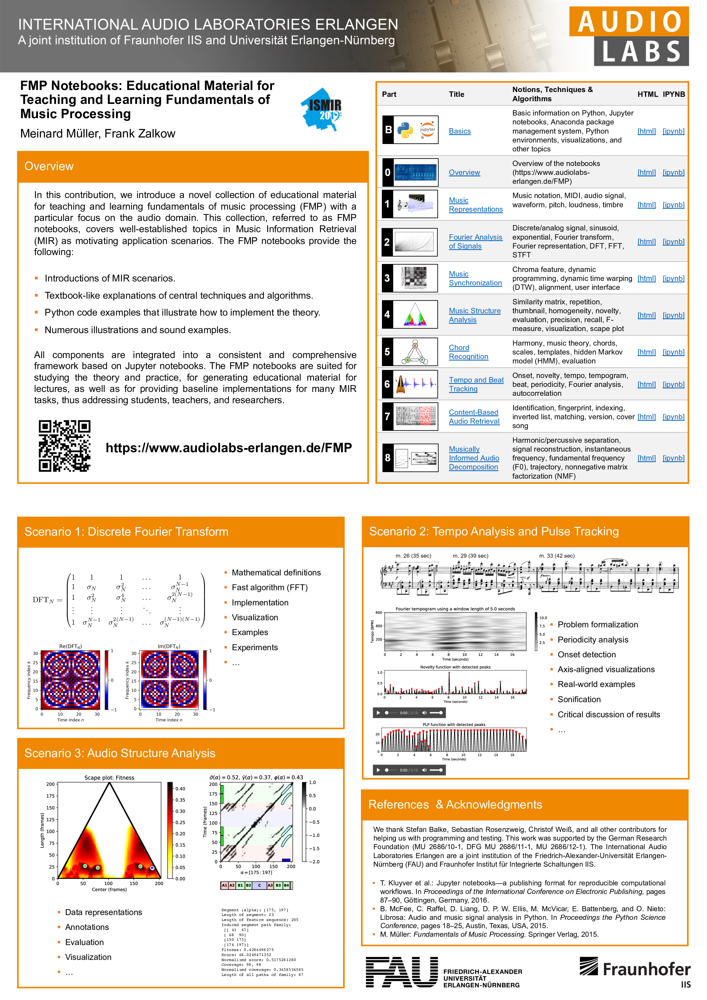
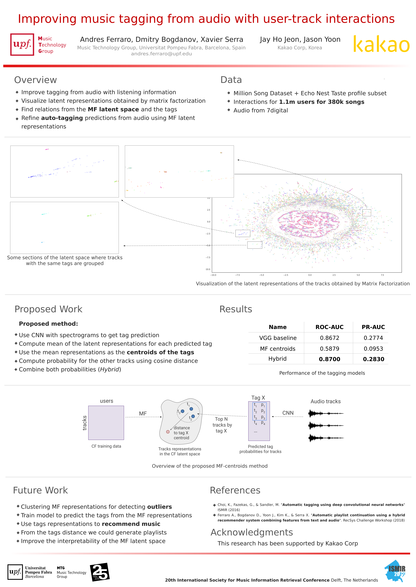

# Online session 1/2 (Sessions A, B, C, D)

## Sessions
[Session A](#session-a),
[Session B](#session-b),
[Session C](#session-c),
[Session D](#session-d),

## Session E

### [E-04] A Diplomatic Edition of Il Lauro Secco: Ground Truth for OMR of White Mensural Notation | [paper](http://archives.ismir.net/ismir2019/paper/000067.pdf) | [dataset](https://github.com/SEILSdataset/SEILSdataset)

Emilia Parada-Cabaleiro, Anton Batliner, Björn Schuller
> "We present a symbolic representation in mensural notation of the anthology Il Lauro Secco. For musicological analysis we encoded the repertoire in **mens and MEI; to support OMR research we present ground truth in agnostic and semantic formats."

### [E-05] The Harmonix Set: Beats, Downbeats, and Functional Segment Annotations of Western Popular Music, Nieto, O., McCallum, M., Davies., M., Robertson, A., Stark, A., Egozy, E. | [poster](posters/E-05-TheHarmonixSet.pdf) | [paper](http://archives.ismir.net/ismir2019/paper/000068.pdf) | [code](https://github.com/urinieto/harmonixset)
> "Human annotated dataset containing beats, downbeats, and structural segmentation for over 900 pop tracks."

### [E-06] FMP Notebooks: Educational Material for Teaching and Learning Fundamentals of Music Processing | [paper](http://archives.ismir.net/ismir2019/paper/000069.pdf) | [web](https://www.audiolabs-erlangen.de/FMP)

[Meinard Müller](https://www.audiolabs-erlangen.de/fau/professor/mueller); [Frank Zalkow](https://www.audiolabs-erlangen.de/fau/assistant/zalkow)
> "The FMP notebooks include open-source Python code, Jupyter notebooks, detailed explanations, as well as numerous audio and music examples for teaching and learning MIR and audio signal processing."

## Session F

### [F-13] Learning Disentangled Representations of Timbre and Pitch for Musical Instrument Sounds Using Gaussian Mixture Variational Autoencoders | [paper](http://archives.ismir.net/ismir2019/paper/000091.pdf) | [demo](https://ismir19-217.github.io/sup-material/ismir19-217-sup-material.html)

[Yin-Jyun Luo](https://yjlolo.github.io/al-folio/); Kat Agres; Dorien Herremans

> "We disentangle pitch and timbre of musical instrument sounds by learning separate interpretable latent spaces using Gaussian mixture variational autoencoders. The model is verified by controllable sound synthesis and many-to-many timbre transfer."

## Session G

### [G-03] Adaptive Time–Frequency Scattering for Periodic Modulation Recognition in Music Signals | [paper](http://archives.ismir.net/ismir2019/paper/000099.pdf) | [dataset](https://zenodo.org/record/3250223)

[Changhong Wang](https://changhongw.github.io/); Emmanouil Benetos; Vincent Lostanlen; Elaine Chew
> "Scattering transform provides a versatile and compact representation for analysing playing techniques."

### [G-05] Unmixer: An Interface for Extracting and Remixing Loops | [paper](http://archives.ismir.net/ismir2019/paper/000101.pdf) | [website](https://unmixer.ongaaccel.jp/) | [poster](http://jblsmith.github.io/documents/smith2019-ismir-unmixer_interface-poster.pdf)

[Jordan B. L. Smith](http://jblsmith.github.io/); Yuta Kawasaki; Masataka Goto
> "Unmixer is a web interface where users can upload music, extract loops, remix them, and mash-up loops from different songs. To extract loops with source separation, we use a nonnegative tensor factorization method improved with a sparsity constraint."

### [G-08] GENERATING STRUCTURED DRUM PATTERN USING VARIATIONAL AUTOENCODER AND SELF-SIMILARITY MATRIX | [paper](http://archives.ismir.net/ismir2019/paper/000104.pdf) | [code](https://github.com/Sma1033/drum_generation_with_ssm)

> "We proposed a model that incorporates long term structure into the music generation process using VAE amd SSM. Subjective evaluation results suggest its effectiveness in generating transitions at structural boundaries."

### [G-12] Audio-query Based Music Source Separation | [paper](http://archives.ismir.net/ismir2019/paper/000108.pdf)

Jie Hwan Lee(*); Hyeong-Seok Choi(*); Kyogu Lee (*: Equal contribution)
> “We propose a network for audio query-based music source separation that can explicitly encode the source information from a query signal regardless of the number and/or kind of target signals. The proposed method consists of a Query-net and a Separator: given a query and a mixture, the Query-net encodes the query into the latent space, and the Separator estimates masks conditioned by the latent vector, which is then applied to the mixture for separation.”

### [G-13] Adaptive Time–Frequency Scattering for Periodic Modulation Recognition in Music Signals | [paper](http://archives.ismir.net/ismir2019/paper/000109.pdf) | [code/examples](https://livingthing.danmackinlay.name/mosaicing_omp_ismir_2019/)

[Dan MacKinlay](https://danmackinlay.name/); Zdravko Botev
> “We apply sparse dictionary decomposition twice to autocorrelograms of signals, to get a novel analysis of and method for mosaicing music style transfer, which has the novel feature of handling time-scaling of the source audio naturally.”

### [G-16] VirtuosoNet: A Hierarchical RNN-based System for Modeling Expressive Piano Performance  | [paper](http://archives.ismir.net/ismir2019/paper/000112.pdf) | [code](https://github.com/jdasam/virtuosoNet)
Dasaem Jeong; Taegyun Kwon; Yoojin Kim; Kyogu Lee; Juhan Nam

> "We present an RNN-based model that reads MusicXML and generates human-like performance MIDI. The model employs a hierarchical approach by using attention network and an independent measure-level estimation module. We share our code and dataset."

## Late-Breaking/Demo

### [L-06] Tools for Semi-Automatic Bounding Box Annotation of Musical Measures in Sheet Music | [paper](http://archives.ismir.net/ismir2019/latebreaking/000006.pdf) | [web](https://www.audiolabs-erlangen.de/resources/MIR/2019-ISMIR-LBD-Measures)

[Frank Zalkow](https://www.audiolabs-erlangen.de/fau/assistant/zalkow); [Angel Villar Corrales](); [TJ Tsai](http://pages.hmc.edu/ttsai/); [Vlora Arifi-Müller](https://www.audiolabs-erlangen.de/fau/assistant/arifi-mueller); [Meinard Müller](https://www.audiolabs-erlangen.de/fau/professor/mueller);
> "In score following, one main goal is to highlight measure positions in sheet music synchronously to audio playback. Such applications require alignments between sheet music and audio representations. Often, such alignments can be computed automatically in the case that the sheet music representations are given in some symbolically encoded music format. However, sheet music is often available only in the form of digitized scans. In this case, the automated computation of accurate alignments poses still many challenges [1]. In this contribution, we present various semi-automatic tools for solving the subtask of determining bounding boxes (given in pixels) of measure positions in digital scans of sheet music—a task that is extremely tedious when being done manually."

### [L-07] Improving Music Tagging from Audio with User-Track Interactions | [paper](http://archives.ismir.net/ismir2019/latebreaking/000007.pdf)

[Andres Ferraro](https://github.com/andrebola); [Jae Ho Jeon](https://www.linkedin.com/in/jae-ho-jeon-036927126); [Jisang Yoon](https://github.com/js1010); [Xavier Serra](https://www.upf.edu/web/xavier-serra); [Dmitry Bogdanov](https://dbogdanov.github.io/about/)
> "We propose to improve the tagging of music by using audio and collaborative filtering information (user-track interactions). We use Matrix Factorization (MF) to obtain a representation of the tracks from the user-track interactions and map those representations to the tags predicted from audio. The preliminary results show that following this approach we can increase the tagging performance."

### [L-10] Creating a Tool for Faciltiating and Researching Human Annotation of Musical Patterns | [paper](http://archives.ismir.net/ismir2019/latebreaking/000010.pdf) | [code](https://github.com/StephanWells/ANOMIC)

[Stephan Wells](); [Iris Yuping Ren](http://irisryp.me/); [Anja Volk](http://www.staff.science.uu.nl/~fleis102/)
> "Musical patterns (repeated segments of music) are highly widespread in all varieties of music, and annotations of such patterns are valuable in many areas of music information retrieval. Unfortunately, there is a lack of expert annotations of musical patterns, and most annotation is done by hand. In this project, we introduce a novel software, ANOMIC, designed for users to intuitively annotate repeated musical segments, and we perform a user study which yields a large database of annotations done using the tool. We find that the tool’s reception was strongly positive and show that the annotations done with it reach high levels of inter-annotator agreement compared to traditional approaches."

### [L-11] nnAudio: A Pytorch Audio Processing Tool Using 1dconvolution Neural Networks | [paper]() | [code](https://github.com/KinWaiCheuk/nnAudio)

[Kin Wai Cheuk](https://github.com/KinWaiCheuk); [Kat Agres](http://katagres.com/biography); [Dorien Herremans](http://dorienherremans.com/biography)
> "With the advent of Graphics Processing Units (GPUs),  many computational methods, such as Tensorflow and PyTorch, are now taking advantage of these technologies to dramatically speed up calculations. The number of GPU based processing libraries for signal processing is limited to tools such as tf.signal, torchaudio (PyTorch based), and Kapre (Tensorflow based).
We propose a PyTorch based neural network audio processing tool called nnAudio. Our library offer GPU-leveraged calculation of linear spectrograms, log spectrograms, Mel Spectrograms (MelSpec), and constant-Q transform (CQT). nnAudio is the only GPU-based library that offers CQT calculation. We record a speed increase of over 100 times when using nnAudio versus traditional signal processing tools"

### [L-12] Generative Audio Synthesis with a Parametric Model | [paper](https://arxiv.org/abs/1911.08335) | [Audio Examples](https://www.ee.iitb.ac.in/student/~krishnasubramani/ismir_notebook.html)

[Krishna Subramani](https://www.ee.iitb.ac.in/student/~krishnasubramani/); Alexandre D'Hooge; [Preeti Rao](https://www.ee.iitb.ac.in/wiki/faculty/prao)
> Propose a parametric representation for audio corresponding more directly to its musical attributes such as pitch, dynamics and timbre. For more control over generation, we also propose the use of a conditional variational autoencoder which conditions the timbre on pitch.

### [L-35] Automated Time-Frequency Domain Audio Crossfades Using Graph Cuts | [paper](http://archives.ismir.net/ismir2019/latebreaking/000035.pdf) | [code](https://github.com/Stack-Attack/time-freq-cut) | ['DJ' Example](https://soundcloud.com/kyle-robinson-13/augmented-recon-dj-4), ['Standard' Example](https://soundcloud.com/kyle-robinson-13/augmented-recon-acoustic)

Kyle Robinson; [Dan Brown](https://cs.uwaterloo.ca/~browndg/)

> "We present the first implementation of a new method to automatically transition between songs by finding an optimal seam in the time-frequency spectrum."

### [L-45] An Opensource Web-based Pattern Annotation Framework - PAF | [paper](http://archives.ismir.net/ismir2019/latebreaking/000045.pdf) | [code](https://bitbucket.org/ul-fri-lgm/patternannotationframework/src)

[Matevž Pesek](); [Darian Tomašević](); [Iris Yuping Ren](http://irisryp.me/); [Matija Marolt]()
> "The Pattern Annotation Framework (PAF) tool collects the data about the annotator and the annotation process, to enable an analysis of relations between the user's experience/background and the annotations. The tool tracks the user's actions, such as the start and end time of an individual annotation and its changes, midi player actions and other. By open-sourcing the tool, we hope to aid other researchers in the MIR field dealing with pattern-related data gathering."

### [L-49] Linking and Visualising Performance Data and Semantic Music Encodings in Real-Time | [paper](http://archives.ismir.net/ismir2019/latebreaking/000049.pdf) | [code](https://github.com/trompamusic/clara) | [web](https://trompa.mdw.ac.at)

[David M. Weigl](https://iwk.mdw.ac.at/david-weigl); [Carlos Cancino-Chacón](http://carloscancinochacon.com/); [Martin Bonev](); [Werner Goebl](https://www.mdw.ac.at/iwk/werner-goebl/)
> "We present CLARA (Companion for Long-term Analyses of Rehearsal Attempts), a visualisation interface for real-time performance-to-score alignment based on the MELD (Music Encoding and Linked Data) framework for semantic digital notation, employing MAPS (Matcher for Alignment of Performance and Score), an HMM-based polyphonic score-following system for symbolic (MIDI) piano performances."

## MIREX
